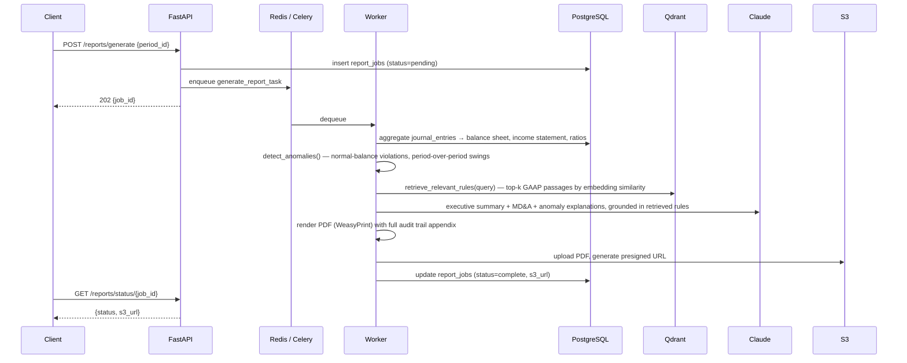
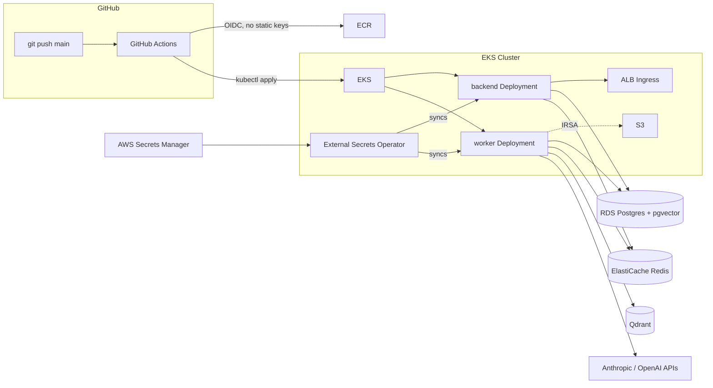

# GL Regulatory Reporting System

An async pipeline that turns raw general-ledger data into an audit-ready financial statement PDF: it aggregates journal entries into a balance sheet and income statement, flags accounting anomalies, retrieves relevant GAAP rules from a vector store, and asks Claude to write the narrative commentary — grounded in those retrieved rules, not free-floating. Everything runs on real AWS infrastructure (EKS, RDS, ElastiCache, S3) deployed by a GitHub Actions pipeline with no long-lived credentials anywhere.

There's no frontend — this is a pure API service. The interesting surface area is the pipeline itself and the infrastructure it runs on.

<p align="center">
  
  
  
</p>

<p align="center"><em>Every number above comes from a live report generated against seeded ledger data on AWS — <a href="docs/sample-report.pdf">full PDF</a> · <a href="docs/sample-report.txt">text extract</a>.</em></p>

## Why this exists

Regulatory financial reporting is a good stress test for LLM-assisted pipelines: the numbers have to be exactly right (a balance sheet that doesn't balance is worse than useless), and the narrative has to be grounded in something auditable rather than the model's own opinion. This project was built to work through that tension end-to-end — deterministic accounting logic doing the arithmetic, an LLM doing only the parts that require language, and a retrieval step in between so the LLM's claims trace back to actual GAAP text instead of being invented.

## How a report gets built



Every step in that pipeline — including each individual LLM call — is written to an `audit_log` table with a timestamp and model version, and rendered as an appendix in the final PDF. If a number in the report is ever questioned, there's a full trace of what generated it.

### The parts that mattered most to get right

- **The accounting has to be actually correct, not just plausible.** Anomaly detection and balance-sheet aggregation both had sign-inversion bugs that only surfaced when I cross-checked the generated PDF against the live API output line by line — every credit-normal account was being flagged as anomalous, and two liability categories were silently dropped from `total_liabilities`. Fixed in [`gl_service.py`](backend/services/gl_service.py); see [`docs/sample-report.txt`](docs/sample-report.txt) for a report where `Assets == Liabilities + Equity` holds exactly.
- **The LLM narrative is retrieval-grounded.** [`embedding_service.py`](backend/services/embedding_service.py) embeds GAAP rule text into Qdrant and does a similarity search per report section; the retrieved passages are quoted directly in the prompt Claude receives, so the executive summary cites actual rule language instead of paraphrasing from parametric memory.
- **Synthetic seed data is real double-entry accounting, not random rows.** [`scripts/seed_data.py`](scripts/seed_data.py) generates 25,000 paired transactions (revenue, expense, asset reallocation, financing, equity) where every event posts matching debit/credit legs, and derives retained earnings from actual computed net income per period — so the balance sheet identity holds by construction, not by a plug entry.

## Stack

| Layer | Choice |
|---|---|
| API | FastAPI (async), Uvicorn |
| Jobs | Celery + Redis |
| Relational data | PostgreSQL (RDS) + pgvector |
| Vector search | Qdrant |
| LLM | Anthropic Claude (narrative), OpenAI embeddings (retrieval) |
| PDF | WeasyPrint |
| Storage | S3, IRSA-scoped (no static credentials in-cluster) |
| Observability | Prometheus (`prometheus-fastapi-instrumentator` + custom Celery-side counters), LangSmith tracing |
| Infra | EKS, ALB Ingress, External Secrets Operator, GitHub Actions with OIDC |

## Infrastructure



CI/CD is a single workflow ([`.github/workflows/deploy.yml`](.github/workflows/deploy.yml)): build the image, push to ECR tagged with the commit SHA, apply the `k8s/` manifests, wait on both the `backend` and `worker` rollouts, then health-check the ALB's `/health` endpoint before calling the deploy done. GitHub authenticates to AWS via OIDC — there are no long-lived AWS access keys stored anywhere, in GitHub or otherwise. Application secrets (DB credentials, API keys) live in AWS Secrets Manager and are synced into the cluster by the External Secrets Operator; pods never see the account's IAM credentials directly, only the narrowly-scoped IRSA role attached to their service account.

A couple of infrastructure problems worth mentioning because they're the kind that only show up once you deploy for real: the AWS Load Balancer Controller's own published IAM policy is missing `ec2:DescribeRouteTables`, so the ALB silently never provisions until you patch it in; and a `RollingUpdate` strategy on a single-node cluster deadlocks on `Insufficient cpu` because the surge pod can't schedule until the old one exits — the worker deployment uses `Recreate` instead.

## API surface

| Endpoint | Purpose |
|---|---|
| `POST /reports/generate` | Enqueue report generation for a period, returns `job_id` |
| `GET /reports/status/{job_id}` | Poll job status; `s3_url` is a presigned link once complete |
| `GET /reports/list` | Last 10 report jobs |
| `GET /ledger/balance-sheet/{period_id}` | Aggregated balance sheet |
| `GET /ledger/income-statement/{period_id}` | Aggregated income statement |
| `GET /ledger/ratios/{period_id}` | Current ratio, debt-to-equity, net margin, ROA |
| `GET /ledger/anomalies/{period_id}` | Normal-balance violations, period-over-period swings |
| `GET /ledger/trial-balance/{period_id}` | Raw trial balance |
| `GET /health` | Liveness/readiness, also the ALB target-group health check |
| `GET /metrics` | Prometheus scrape endpoint |

Full interactive docs are served at `/docs` (Swagger UI) on any running instance.

## Getting started (local)

```bash
cp .env.example .env   # fill in ANTHROPIC_API_KEY / OPENAI_API_KEY
docker-compose up
python scripts/seed_data.py   # seeds 2 periods, chart of accounts, 25k balanced journal entries
curl -X POST localhost:8000/reports/generate -H 'Content-Type: application/json' -d '{"period_id": 2}'
```

Poll `GET /reports/status/{job_id}` until `status: complete`, then fetch the PDF from the returned `s3_url` (or local filesystem, if S3 isn't configured — the service degrades gracefully rather than failing the whole pipeline).

## Deploying to AWS

### 1. Provision AWS resources

Run each section of `infra/aws-setup.sh` in order, filling in the VPC/subnet-group placeholders for your account:

```bash
bash infra/aws-setup.sh rds          # RDS Postgres 15 (db.t3.micro) + pgvector
bash infra/aws-setup.sh redis        # ElastiCache Redis (cache.t3.micro)
bash infra/aws-setup.sh s3           # gl-reporting-reports-<account-id>, private, versioned
bash infra/aws-setup.sh ecr          # gl-reporting-backend repository
DB_ENDPOINT=... DB_PASSWORD=... REDIS_ENDPOINT=... \
  bash infra/aws-setup.sh secrets    # writes gl-reporting/prod to Secrets Manager
GITHUB_REPO=<org>/<repo> \
  bash infra/aws-setup.sh github-oidc  # GitHub Actions OIDC provider + deploy role
```

After the `secrets` step, replace the `ANTHROPIC_API_KEY` / `OPENAI_API_KEY` placeholders with real values (see the script's output for the exact `put-secret-value` command).

Store the role ARN printed by the `github-oidc` step as the `AWS_DEPLOY_ROLE_ARN` secret in the GitHub repo settings.

### 2. Create the EKS cluster and cluster add-ons

```bash
bash infra/eks-setup.sh cluster              # eksctl-managed EKS cluster, t3.medium, 1-3 nodes
bash infra/eks-setup.sh alb-controller       # AWS Load Balancer Controller, for k8s/ingress.yaml
bash infra/eks-setup.sh external-secrets     # External Secrets Operator, for k8s/secrets.yaml
bash infra/eks-setup.sh app-service-account  # scoped IRSA role for backend/worker pod S3 access
```

Then grant the GitHub Actions deploy role access to the cluster (also printed by `aws-setup.sh github-oidc`):

```bash
aws eks create-access-entry --cluster-name gl-reporting-cluster \
  --principal-arn <role-arn> --type STANDARD --region us-east-1
aws eks associate-access-policy --cluster-name gl-reporting-cluster \
  --principal-arn <role-arn> --access-scope type=cluster \
  --policy-arn arn:aws:eks::aws:cluster-access-policy/AmazonEKSClusterAdminPolicy --region us-east-1
```

### 3. Deploy

Push to `main`. `.github/workflows/deploy.yml` builds the image, pushes it to ECR tagged with the commit SHA, applies `k8s/`, waits for both the `backend` and `worker` rollouts, and health-checks the ALB's `/health` endpoint before finishing.

The backend and worker deployments share the same image (`k8s/backend-deployment.yaml`, `k8s/worker-deployment.yaml`) — only the container `command` differs (`uvicorn` vs `celery worker`).

### Rollback

```bash
kubectl rollout undo deployment/backend -n gl-reporting
kubectl rollout undo deployment/worker -n gl-reporting
```

To go back further than one revision, check `kubectl rollout history deployment/backend -n gl-reporting` and target a specific one with `--to-revision=<N>`.

## Structure

```
backend/     FastAPI application, Celery worker tasks, and business logic
  routers/       HTTP endpoints (reports, ledger, monitoring)
  services/      GL aggregation, anomaly detection, LLM calls, embeddings, PDF, S3
  workers/       Celery app config and the report generation task
scripts/     Database init, synthetic double-entry seed data, GAAP rule embedding
infra/       AWS resource provisioning (RDS, ElastiCache, S3, ECR, Secrets Manager, EKS)
k8s/         Kubernetes manifests deployed to EKS
.github/workflows/  CI/CD pipeline (build, push, deploy, health-check)
docker-compose.yml  Local development infrastructure
```
