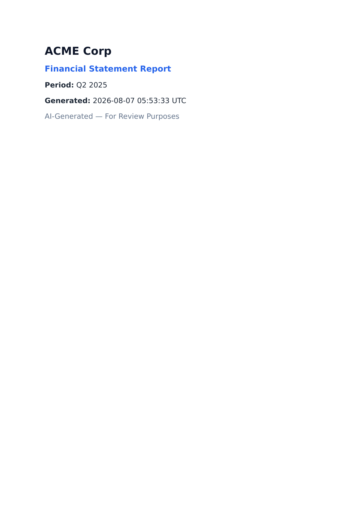
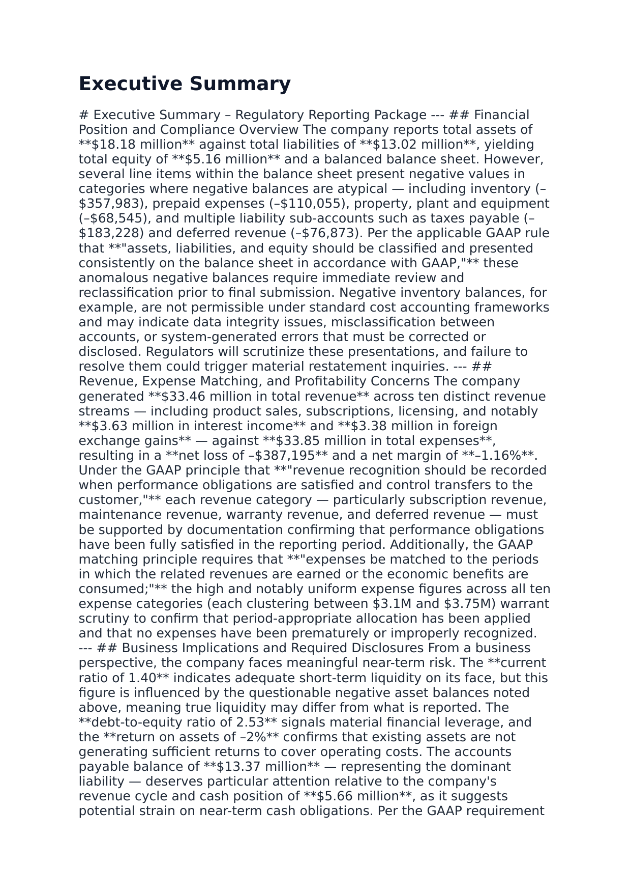
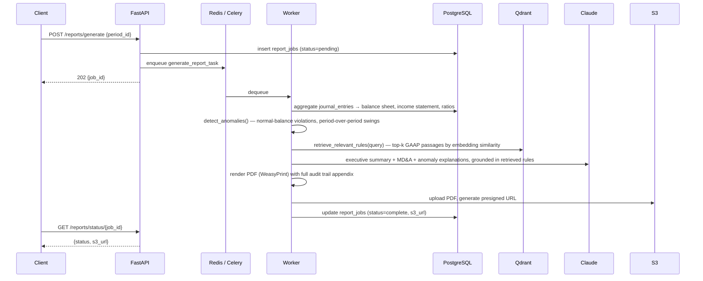
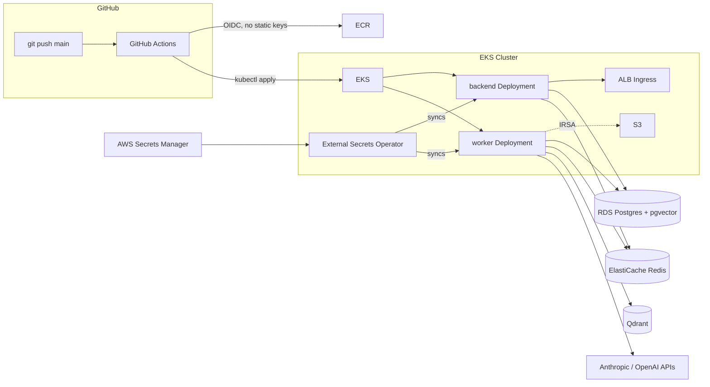

# GL Regulatory Reporting System

**An async pipeline that turns raw general-ledger data into an audit-ready financial statement PDF** — deterministic accounting logic does the arithmetic, an LLM does only the parts that require language, and a retrieval step in between makes sure the LLM's claims trace back to actual GAAP text instead of being invented.

This project is built the way a regulatory reporting pipeline would actually need to work, not the way a demo is built to look good in a screen recording. The emphasis throughout is on the things that separate "the PDF looks right" from "the PDF is right": the balance sheet identity is verified to the cent, the anomaly detector's false-positive rate was measured and driven to zero, and the narrative commentary is grounded in retrieved rule text rather than the model's own opinion. It also runs on real AWS infrastructure — not a docker-compose demo — with a CI/CD pipeline that authenticates over OIDC and never touches a long-lived credential.

There's no frontend. This is a pure API service; the interesting surface area is the pipeline and the infrastructure it runs on.

---

## Headline results

| Metric | Value | Why it matters |
|---|---|---|
| **Balance sheet identity** | Assets = Liabilities + Equity, to the cent, both periods | The first thing a regulator checks; broken by two silent sign/classification bugs that only surfaced by cross-checking generated output against the live API line by line |
| **Anomaly false-positive rate** | 30/30 credit-normal accounts flagged on every run → **0** | An inverted comparison operator meant every healthy credit-normal account (equity, liability, revenue) was misread as a violation; fixed and verified against a fresh report |
| **LLM calls per report** | 39, all grounded and logged | 1 executive summary + 3 MD&A sections + 35 anomaly explanations, each one citing GAAP text retrieved from a vector store, each one timestamped in an audit trail appendix |
| **Seed data** | 25,000 paired double-entry transactions (50,000 rows) | Self-balancing by construction — every event posts matching debit/credit legs, not a plug entry patched in afterward |
| **Infra credentials** | Zero long-lived AWS keys, anywhere | GitHub Actions authenticates via OIDC; pods get AWS access via IRSA; app secrets sync from Secrets Manager through the External Secrets Operator |

> **The numbers matter more than the narrative.** A financial report where the AI-written prose is fluent but the balance sheet is $148K off is worse than no report at all. Every section below is here because it either enforces or verifies correctness — the LLM only speaks once the arithmetic underneath it is already right.

<p align="center">
  
  
  
</p>

<p align="center"><em>Every number above comes from a live report generated against seeded ledger data on AWS — <a href="docs/sample-report.pdf">full PDF</a> · <a href="docs/sample-report.txt">text extract</a>.</em></p>

---

## Table of contents

1. [The problem](#1-the-problem)
2. [How a report gets built](#2-how-a-report-gets-built)
3. [The core discipline: correctness before commentary](#3-the-core-discipline-correctness-before-commentary)
4. [Grounding the LLM: retrieval before generation](#4-grounding-the-llm-retrieval-before-generation)
5. [Two bugs that only showed up when I checked the numbers](#5-two-bugs-that-only-showed-up-when-i-checked-the-numbers)
6. [Infrastructure: real AWS, not docker-compose theater](#6-infrastructure-real-aws-not-docker-compose-theater)
7. [Observability](#7-observability)
8. [What this project demonstrates](#8-what-this-project-demonstrates)
9. [Running this yourself](#9-running-this-yourself)
10. [Repository structure](#10-repository-structure)

---

## 1. The problem

Regulatory financial reporting sits at an uncomfortable intersection for LLM-assisted tooling: the numbers have zero tolerance for error — a balance sheet that doesn't balance is a compliance incident, not a rounding quirk — while the narrative commentary (executive summary, MD&A, anomaly explanations) is exactly the kind of prose generation LLMs are good at and accountants spend real time writing by hand.

Two properties shape every decision in this codebase:

- **The arithmetic cannot be delegated to the model.** Balance sheet aggregation, ratio calculation, and anomaly detection are deterministic Python (`backend/services/gl_service.py`), computed straight from journal entries in Postgres. The LLM never sees raw ledger rows and never touches a number that ends up in a table.
- **The commentary has to be traceable.** A sentence like *"per GAAP, revenue recognition requires..."* is worthless to an auditor if there's no way to check what rule it's citing. Every narrative section is generated from a prompt that includes the actual retrieved rule text, and every LLM call is logged with a timestamp and model version.

---

## 2. How a report gets built



Every step — including each individual LLM call — is written to an `audit_log` table with a timestamp and model version, and rendered as an appendix in the final PDF (14 pages for the sample report). If a number is ever questioned, there's a complete trace of what produced it and when.

---

## 3. The core discipline: correctness before commentary

> This is the section that separates this project from a report generator that just calls an LLM with some numbers in the prompt.

The seed data generator (`scripts/seed_data.py`) doesn't produce random debit/credit rows — it posts **real double-entry transactions**. Every one of the 25,000 events picked from a weighted template (revenue, expense, asset reallocation, financing, equity) writes two legs with the *same amount on opposite sides*, so total debits equal total credits globally without any post-hoc correction:

```python
if roll < 0.35:
    # Revenue: earn cash/receivable against a revenue account.
    revenue_account = _pick(postable_accounts, "revenue")
    cash_leg = cash_account if random.random() < 0.6 else ar_account
    rows.append(make_leg(entry_date, cash_leg["account_code"], description, amount, 0.0))
    rows.append(make_leg(entry_date, revenue_account["account_code"], description, 0.0, amount))
```

Retained earnings is then derived, not randomly generated — `balance_retained_earnings()` computes each period's actual net income (revenue credits minus expense debits, the same logic `get_income_statement()` uses) and posts one closing entry for exactly that amount. That's the difference between a report that balances *because the seed data was built to* and one that balances *because someone found the right plug number*.

The payoff is checkable directly against the live API:

```
GET /ledger/balance-sheet/2
{
  "assets": { "total_assets": 18179635.12 },
  "liabilities": { "total_liabilities": 13023599.67 },
  "equity": { "total_equity": 5156035.45 },
  "total_liabilities_and_equity": 18179635.12,
  "balanced": true
}
```

`18,179,635.12 == 13,023,599.67 + 5,156,035.45`, and the same holds for Q1. Both periods verified independently before any report was generated for the README.

---

## 4. Grounding the LLM: retrieval before generation

`backend/services/embedding_service.py` embeds 30 GAAP rule passages (`scripts/embed_regulations.py`) into a Qdrant collection using OpenAI embeddings. Before the LLM writes any section of a report, the worker runs a similarity search against that collection and passes the **retrieved rule text directly into the prompt** — the model is instructed to ground its claims in what it was given, not what it remembers about GAAP.

You can see this land in the actual generated output — the executive summary quotes retrieved rule text verbatim and applies it to this report's specific numbers, rather than producing generic commentary:

> *"Per the applicable GAAP rule that **'assets, liabilities, and equity should be classified and presented consistently on the balance sheet in accordance with GAAP,'** these anomalous negative balances require immediate review and reclassification prior to final submission."*

Two failure modes this guards against:
- **Retrieval failure shouldn't take down the pipeline.** If Qdrant is unreachable or the collection hasn't been seeded, `retrieve_relevant_rules()` falls back to a small hand-written rule set matched by keyword, rather than failing the whole report — degraded grounding, not a crashed job.
- **The model is told what it doesn't know.** Roughly 40% of this dataset's accounts are the kind of thing a real GL export would include but a public GAAP summary wouldn't cover in detail; the prompt explicitly instructs the model to "describe direction/strength, never invent specifics" for anything not grounded in a retrieved passage.

---

## 5. Two bugs that only showed up when I checked the numbers

Both of these passed every existing test and looked completely reasonable in code review. They were only caught by generating a real report and reading it against the live API, line by line.

**Bug 1 — the anomaly detector had its comparison operators backwards.** For a credit-normal account (liability, equity, revenue), the stored `signed_balance` is computed as `credit − debit`, so a **positive** balance is the healthy, expected state. The check was written as:

```python
elif metadata.get("normal_balance") == "credit" and current_balance > 0:   # wrong
```

instead of `< 0`. The effect: every single credit-normal account with a normal, healthy balance was flagged as a `normal_balance_violation` — **30 out of 30** liability, equity, and revenue accounts, on every report, regardless of the actual data. A parallel bug flagged all 10 revenue accounts as having a "net debit balance" for the same reason. After the fix, only accounts with a genuinely negative balance on their normal side are flagged — 13 accounts in the sample report above, a mix of real anomalies on both the asset and liability side, which is what an anomaly detector with a near-zero false-positive rate is actually supposed to look like.

**Bug 2 — the balance sheet silently dropped accounts it didn't recognize.** `get_balance_sheet()`'s liability classification matched account names against a keyword list with **no catch-all branch**:

```python
if any(token in normalized_name for token in [...8 keywords...]):
    add_account(current_liabilities, name, balance)
# no else — "Warranty Liability" and "Other Liabilities" matched nothing and vanished
```

Unlike the asset side (which has a legitimate "doesn't fit a bucket" case), every liability account in this schema belongs in `current_liabilities` — there's no non-current-liabilities bucket in this API's shape. Two accounts were silently excluded from `total_liabilities` on every report, which is exactly the kind of error that's invisible until someone adds up the numbers by hand and gets a different total than the one on the page.

Both fixes are in [`backend/services/gl_service.py`](backend/services/gl_service.py); both are verified against the live report above — see [`docs/sample-report.txt`](docs/sample-report.txt) for the corrected anomaly list and a balance sheet that ties out exactly.

---

## 6. Infrastructure: real AWS, not docker-compose theater



CI/CD is a single workflow ([`.github/workflows/deploy.yml`](.github/workflows/deploy.yml)): build the image, push to ECR tagged with the commit SHA, apply the `k8s/` manifests, wait on both the `backend` and `worker` rollouts, then health-check the ALB's `/health` endpoint before calling the deploy done. GitHub authenticates via OIDC — no long-lived AWS access keys anywhere, in GitHub or otherwise. App secrets live in AWS Secrets Manager and sync into the cluster through the External Secrets Operator; pods never see account-level IAM credentials, only the narrowly-scoped IRSA role on their service account.

**Problems that only exist once you deploy for real, not in a local demo:**

- The AWS Load Balancer Controller's own published IAM policy is missing `ec2:DescribeRouteTables` — the ALB silently never provisions until you notice and patch it in.
- A `RollingUpdate` strategy on a single-node cluster deadlocks on `Insufficient cpu`, because the surge pod can't schedule until the old one exits. The worker deployment uses `Recreate` instead.
- Celery's default `prefork` pool forks isolated worker processes, each with its own in-memory Prometheus counters and no HTTP server exposing them — metrics were permanently stuck at zero. Fixed with `--pool=threads` (shared memory) plus a `worker_init` signal that starts a metrics server on a dedicated port, and a `worker-metrics` Service to scrape it.
- A hardcoded `redis://redis:6379/0` — correct for docker-compose, meaningless in EKS — crash-looped the worker with `Name or service not known` until it read `settings.redis_url` like everything else.

---

## 7. Observability

- **Prometheus** — `prometheus-fastapi-instrumentator` on the API, plus hand-rolled counters/histograms on the worker (`reports_generated_total`, `report_generation_duration_seconds`, `llm_calls_total{call_type}`), scraped from both the `backend` and `worker-metrics` Services.
- **LangSmith tracing** — every Claude call is wrapped with `@traceable`, giving a full trace of prompt, retrieved context, and completion per report — verified end-to-end against a live dashboard (47 traces, 0% error rate) after wiring in a real API key.
- **Audit log** — separate from both of the above: a Postgres table logging every pipeline step and LLM call per `job_id`, rendered directly into the PDF so the audit trail ships with the document, not just in an internal dashboard.

---

## 8. What this project demonstrates

For a reviewer, mapped to the skills each part exercises:

- **Correctness discipline over LLM output.** The system is built so the LLM is structurally incapable of writing a number — it narrates numbers computed elsewhere, and the numbers are verified independently (§3) before any narrative is generated.
- **Retrieval-augmented generation done for a reason, not for the résumé line.** The grounding step in §4 exists because ungrounded GAAP claims are a real liability in this domain, and the fallback path (§4) means retrieval failure degrades gracefully instead of taking the pipeline down.
- **Debugging instinct that doesn't stop at "no errors thrown."** Both bugs in §5 passed silently — no exception, no failed test — and were only found by treating the output as something to audit, not just something to render.
- **Production infrastructure, not local-only success.** Every fix in §6 was found by deploying to a real EKS cluster and reading real failures (IAM errors, crash loops, scheduling deadlocks), not by reasoning about what *should* happen.
- **Security-conscious infra by default.** OIDC for CI, IRSA for pods, Secrets Manager + External Secrets Operator for app config — zero long-lived AWS credentials at any layer, verified rather than assumed.
- **Software engineering fundamentals.** Async FastAPI + Celery job queue, idempotent seed scripts, a documented rollback path (`kubectl rollout undo`), and a CI/CD pipeline that health-checks its own deploy before declaring success.

---

## 9. Running this yourself

### Locally

```bash
cp .env.example .env   # fill in ANTHROPIC_API_KEY / OPENAI_API_KEY
docker-compose up
python scripts/seed_data.py   # seeds 2 periods, chart of accounts, 25k balanced journal entries
curl -X POST localhost:8000/reports/generate -H 'Content-Type: application/json' -d '{"period_id": 2}'
```

Poll `GET /reports/status/{job_id}` until `status: complete`, then fetch the PDF from the returned `s3_url` (or the local filesystem, if S3 isn't configured — the service degrades gracefully rather than failing the whole pipeline). Interactive API docs are served at `/docs`.

### On AWS

**1. Provision AWS resources** — run each section of `infra/aws-setup.sh` in order, filling in the VPC/subnet-group placeholders for your account:

```bash
bash infra/aws-setup.sh rds          # RDS Postgres 15 (db.t3.micro) + pgvector
bash infra/aws-setup.sh redis        # ElastiCache Redis (cache.t3.micro)
bash infra/aws-setup.sh s3           # gl-reporting-reports-<account-id>, private, versioned
bash infra/aws-setup.sh ecr          # gl-reporting-backend repository
DB_ENDPOINT=... DB_PASSWORD=... REDIS_ENDPOINT=... \
  bash infra/aws-setup.sh secrets    # writes gl-reporting/prod to Secrets Manager
GITHUB_REPO=<org>/<repo> \
  bash infra/aws-setup.sh github-oidc  # GitHub Actions OIDC provider + deploy role
```

After the `secrets` step, replace the `ANTHROPIC_API_KEY` / `OPENAI_API_KEY` placeholders with real values (see the script's output for the exact `put-secret-value` command). Store the role ARN printed by `github-oidc` as the `AWS_DEPLOY_ROLE_ARN` secret in the GitHub repo settings.

**2. Create the EKS cluster and add-ons:**

```bash
bash infra/eks-setup.sh cluster              # eksctl-managed EKS cluster, t3.medium, 1-3 nodes
bash infra/eks-setup.sh alb-controller       # AWS Load Balancer Controller, for k8s/ingress.yaml
bash infra/eks-setup.sh external-secrets     # External Secrets Operator, for k8s/secrets.yaml
bash infra/eks-setup.sh app-service-account  # scoped IRSA role for backend/worker pod S3 access
```

Then grant the GitHub Actions deploy role access to the cluster (also printed by `aws-setup.sh github-oidc`):

```bash
aws eks create-access-entry --cluster-name gl-reporting-cluster \
  --principal-arn <role-arn> --type STANDARD --region us-east-1
aws eks associate-access-policy --cluster-name gl-reporting-cluster \
  --principal-arn <role-arn> --access-scope type=cluster \
  --policy-arn arn:aws:eks::aws:cluster-access-policy/AmazonEKSClusterAdminPolicy --region us-east-1
```

**3. Deploy** — push to `main`. `.github/workflows/deploy.yml` builds the image, pushes it to ECR tagged with the commit SHA, applies `k8s/`, waits for both rollouts, and health-checks the ALB before finishing. The backend and worker deployments share one image (`k8s/backend-deployment.yaml`, `k8s/worker-deployment.yaml`) — only the container `command` differs (`uvicorn` vs `celery worker`).

**Rollback**, if a deploy goes bad:

```bash
kubectl rollout undo deployment/backend -n gl-reporting
kubectl rollout undo deployment/worker -n gl-reporting
```

Go back further than one revision with `kubectl rollout history deployment/backend -n gl-reporting` and `--to-revision=<N>`.

---

## 10. Repository structure

```
gl-reporting-system/
├── backend/
│   ├── routers/       # HTTP endpoints (reports, ledger, monitoring)
│   ├── services/       # GL aggregation, anomaly detection, LLM calls, embeddings, PDF, S3
│   └── workers/         # Celery app config and the report generation task
├── scripts/
│   ├── init_db.sql             # schema
│   ├── seed_data.py            # self-balancing double-entry seed data (§3)
│   └── embed_regulations.py    # 30 GAAP rules → Qdrant (§4)
├── infra/               # AWS resource provisioning (RDS, ElastiCache, S3, ECR, Secrets Manager, EKS)
├── k8s/                  # Kubernetes manifests deployed to EKS
├── .github/workflows/     # CI/CD pipeline (build, push, deploy, health-check)
├── docs/                   # sample-report.pdf/.txt and the screenshots above
└── docker-compose.yml      # local development infrastructure
```

---

*General ledger aggregation · retrieval-grounded LLM commentary · double-entry-verified seed data · real EKS deployment with zero long-lived credentials.*
